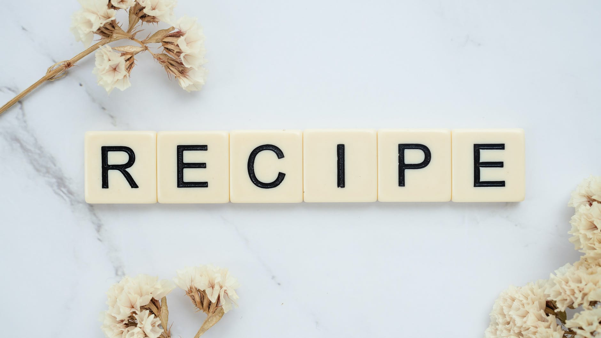

# Odin Recipes

This is a somewhat basic project that demonstrates the use of links and images in a project. I have created a landing page that presents three recipes. 

Clicking on the image of a particular dish takes you to its page which displays the dish, its ingredients, and step-by-step directions of its preparation. Clicking on the 'Home' link in the upper right hand corner of the page returns the user to the landing page.

I linked an external style sheet to each page which is responsible for:
- rounding the corners of each image
- creating a shadow below each image
- formatting each `block` of three elements; heading, paragraph, and image

The images were downloaded from:
 [https://pixabay.com/](https://pixabay.com/)

[https://www.pexels.com/](https://www.pexels.com/)
#

### Instructions on how to markdown files are below:
#

# Header 1
## Header 2
### Header 3

- Bulleted
- List

1. Numbered
2. List

**Bold** and _Italic_ and `Code` text
[Link](url) and src: 
